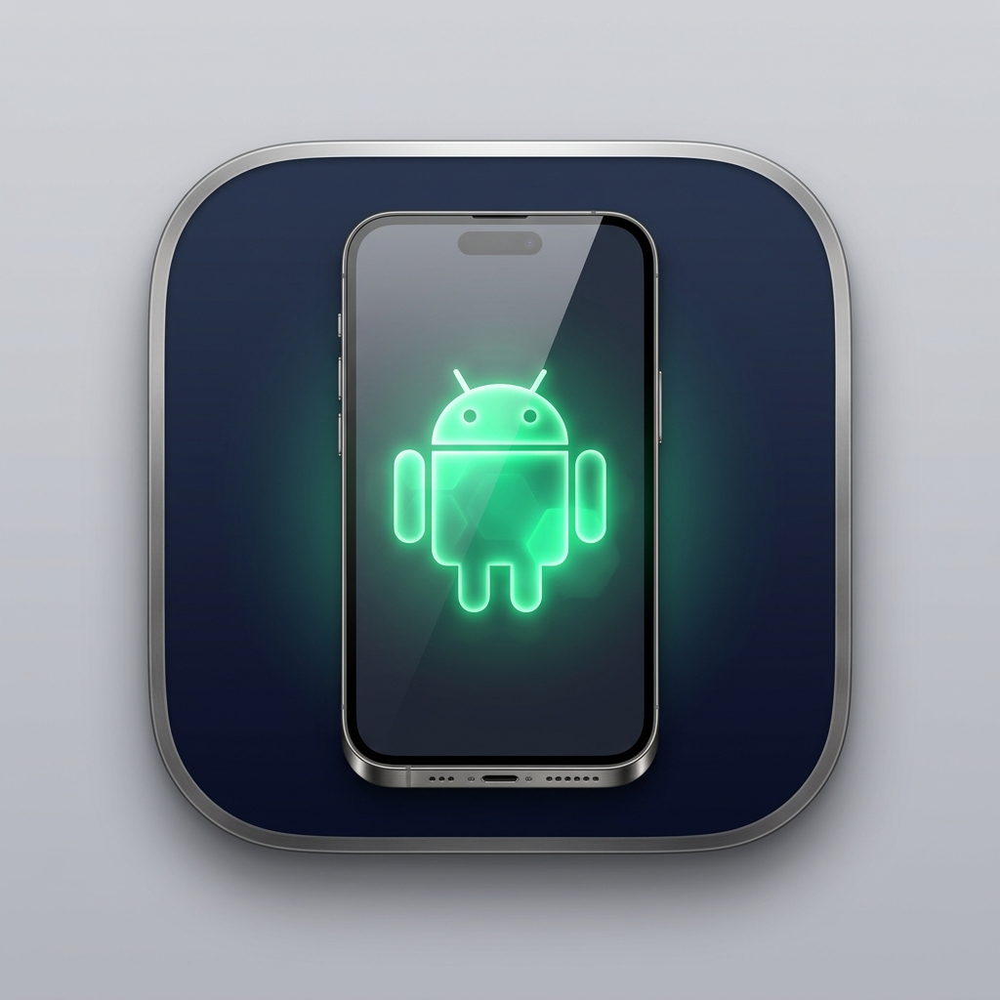

<div align="center">
  
  <h1>AeroSync</h1>
  <p><b>Next-Generation Android Continuity on macOS</b></p>
  <p>Scrcpy Screen Mirroring • Tailscale Mesh (5G/Wi-Fi) • Call HUD & Dialer • Notification & OTP Relay • Remote Terminal Gateway</p>
  
  <p>
    <a href="https://github.com/mkdirharkeerat/Aerosync/releases/tag/v1.0.0">
      
    </a>
    
    
  </p>
</div>

---

## 📖 Table of Contents
1. [Overview](#-overview)
2. [Prerequisites](#-prerequisites)
3. [Step 1: Setting Up the macOS App](#-step-1-setting-up-the-macos-app)
4. [Step 2: Setting Up the Android Companion App](#-step-2-setting-up-the-android-companion-app)
5. [Step 3: Connecting Your Mac and Android Phone](#-step-3-connecting-your-mac-and-android-phone)
6. [Step 4: Wireless ADB Setup for Screen Mirroring](#-step-4-wireless-adb-setup-for-screen-mirroring)
7. [Features & Walkthrough](#-features--walkthrough)
   - [Screen Mirroring & Control](#1-screen-mirroring--control-scrcpy)
   - [Phone Calls & Dialer](#2-phone-calls--dialer)
   - [Call Audio Routing & The macOS Bluetooth Reality](#3-call-audio-routing-explained)
   - [Notification Mirroring & OTP Extraction](#4-notification-mirroring--instant-otp-copy)
   - [Remote Mac Terminal & Agy CLI Gateway](#5-remote-mac-terminal--agy-cli-gateway)
8. [Troubleshooting & FAQs](#-troubleshooting--faqs)

---

## 🌟 Overview
**AeroSync** unifies your Android phone with macOS without requiring root or custom ROMs. It provides real-time screen mirroring, a native dialer and incoming call HUD, notification syncing with 1-click OTP copying, and the ability to execute terminal commands (like `agy` or shell scripts) on your Mac directly from your phone.

---

## 🧰 Prerequisites

### On your Mac:
* **macOS 14 (Sonoma) or newer** (Apple Silicon or Intel).
* **`scrcpy` and `adb`** (for screen mirroring):
  ```bash
  brew install scrcpy android-platform-tools
  ```
* *(Optional)* **Tailscale**: If you want to connect remotely over 5G/LTE mobile data.

### On your Android Phone:
* **Android 8.0 (Oreo) or newer** (Android 11+ recommended for Wireless Debugging).
* Developer Options enabled (`Settings > About phone > tap 'Build number' 7 times`).
* *(Optional)* **Tailscale App** from Google Play (if connecting over mobile data).

---

## 💻 Step 1: Setting Up the macOS App

### Option A: Install via Pre-built DMG
1. Download **`AeroSync.dmg`** from the [GitHub Releases](https://github.com/mkdirharkeerat/Aerosync/releases) section.
2. Double-click the DMG and drag **AeroSync** into your `/Applications` folder.
3. Launch **AeroSync**. When prompted, grant **Notification** permissions so AeroSync can deliver incoming call HUDs and mirrored notifications.

### Option B: Build from Source
If you want to compile and package the app yourself:
```bash
git clone https://github.com/mkdirharkeerat/Aerosync.git
cd Aerosync/AeroSync-macOS
./build_app.sh
```
This builds a native release binary and packages both:
* `build/AeroSync.app`
* `build/AeroSync.dmg`

---

## 📱 Step 2: Setting Up the Android Companion App

1. Open **Android Studio**.
2. Select **Open** and choose the [`AeroSync-Android`](AeroSync-Android) folder from the repository.
3. Plug in your Android phone via USB (or connect via Wireless Debugging) with USB Debugging enabled.
4. Click **Run (`Shift + F10`)** to compile and install the APK onto your device.
5. Once the app opens on your phone:
   * **Notification Permission**: Tap **"Grant Notification Listener Permission"** in the app to open Android's settings and toggle on **AeroSync**.
   * **Phone Permissions**: Accept the system dialogs for `Phone State` and `Call Phone` permissions.

---

## 🔗 Step 3: Connecting Your Mac and Android Phone

AeroSync supports two connection modes:

### Mode 1: Local Wi-Fi (Same Network)
1. Ensure both your Mac and Android phone are on the same Wi-Fi network.
2. Find your Mac's local IP address by running:
   ```bash
   ipconfig getifaddr en0
   ```
   *(Example: `192.168.1.45`)*
3. On the phone app, enter `192.168.1.45` in the **Mac IP Address** field and tap **Connect**.

### Mode 2: Tailscale Mesh (Cellular 5G/LTE or Remote Wi-Fi)
1. Install **Tailscale** on your Mac (`brew install --cask tailscale` or Mac App Store) and on Android (Google Play).
2. Sign in to the same Tailscale account on both devices.
3. On your Mac, get your Tailscale IP:
   ```bash
   tailscale ip -4
   ```
   *(Example: `100.85.12.34`)*
4. In the Android app, enter `100.85.12.34` and tap **Connect**. You can now leave your house on 5G and stay connected to your Mac!

---

## ⚡ Step 4: Wireless ADB Setup for Screen Mirroring

Screen mirroring uses the high-performance `scrcpy` engine. On Android 11+, you can connect completely wire-free:

1. On your phone: Go to **Settings > Developer Options > Wireless Debugging** and turn it **ON**.
2. Tap **"Pair device with pairing code"**. A dialog will show an IP address, a 5-digit port, and a 6-digit pairing code.
3. In your Mac's terminal, run:
   ```bash
   adb pair <PHONE_IP>:<PAIRING_PORT> <PAIRING_CODE>
   ```
4. Now look at the main Wireless Debugging screen on your phone for the *Connection* IP and port, and run:
   ```bash
   adb connect <PHONE_IP>:<CONNECT_PORT>
   ```
5. In the **AeroSync macOS App**, navigate to the **Screen Mirror** tab and click **Start Screen Mirror**!

---

## 🎯 Features & Walkthrough

### 1. Screen Mirroring & Control (`scrcpy`)
* Low-latency 60–120 FPS display streaming with keyboard and mouse input.
* **Turn Off Phone Screen**: Keeps your phone's physical screen powered off while you control it on your Mac, preserving battery life and eliminating heat.
* **Audio Forwarding**: Uses the Opus codec to stream media and app sounds directly to your Mac.

### 2. Phone Calls & Dialer
* **Dialer Keypad**: Dial any phone number directly from the Mac app.
* **Incoming Call HUD**: When your phone rings, a macOS alert banner and an in-app HUD display the caller's name/number with **Answer** and **Decline** buttons.

### 3. Call Audio Routing Explained
> [!IMPORTANT]
> **Why macOS cannot act directly as a Bluetooth headset:**
> When an Android phone pairs to a Mac via Bluetooth, macOS identifies itself as a `Computer / Audio Source` (`0x010c`). macOS intentionally **does not advertise the Bluetooth Hands-Free (HFP) sink role** to non-Apple devices.
> 
> **How to handle call audio seamlessly:**
> * **Recommended (Multipoint Bluetooth)**: Connect Bluetooth headphones (such as Sony WH-1000XM4/5, Galaxy Buds, Bose, Pixel Buds, or AirPods) to **both your Mac and phone simultaneously**. When you answer or dial a call in AeroSync on your Mac, your headphones seamlessly receive the call audio from the phone!
> * **Alternative**: Take the call via phone speakerphone or a physical USB-C audio interface.

### 4. Notification Mirroring & Instant OTP Copy
* Incoming phone notifications appear in the macOS Notification Center and in the AeroSync **Notifications** feed.
* **Auto-OTP Extraction**: AeroSync scans incoming SMS and verification messages for 4-to-8-digit security codes. A prominent **"Copy OTP"** button lets you paste the code into your browser in one click.
* **Inline Quick Replies**: Send instant replies to WhatsApp, Telegram, or SMS messages directly from the macOS card.

### 5. Remote Mac Terminal & Agy CLI Gateway
* Control your Mac from your phone from anywhere in the world.
* **Quick Action Buttons**:
  * *Sleep Display*: `pmset displaysleepnow`
  * *Mac Uptime*: `uptime`
  * *Agy CLI*: `~/.local/bin/agy --version`
* **Custom Execution**: Send any shell command or run Antigravity (`agy`) background coding tasks from your phone while away from your desk.

---

## 🛠️ Troubleshooting & FAQs

#### Q: The Android app says "Connection Error" when I tap Connect.
* Ensure the AeroSync macOS app is running (the Bridge Server listens on port `8920`).
* Check that both devices are on the same subnet, or that Tailscale is connected on both sides.
* Check your Mac's firewall in **System Settings > Network > Firewall** to allow incoming connections on port 8920.

#### Q: Notifications are not mirroring to my Mac.
* Open Android **Settings > Apps > Special App Access > Device & App Notifications** and ensure **AeroSync** has permission turned on.
* If your phone has aggressive battery optimization (Xiaomi, OnePlus, Samsung), exempt AeroSync from battery saver in app settings.

#### Q: `scrcpy` fails to launch from the Mac app.
* Test ADB connectivity manually in your Mac terminal:
  ```bash
  adb devices
  ```
  If your device shows as `unauthorized`, look at your phone's screen and tap **"Always allow from this computer"**.
